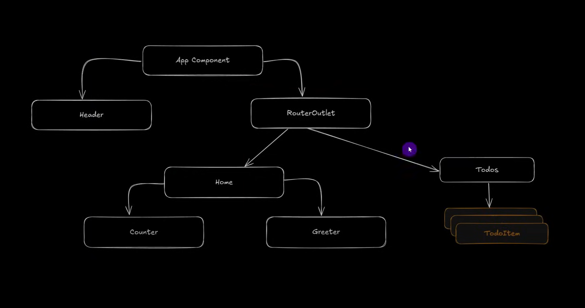

# FirstAngularApp

This project was generated using [Angular CLI](https://github.com/angular/angular-cli) version 19.0.6.

## Features Used

This project implements the following Angular features, as demonstrated in the tutorial:

1. **Introduction and Setup**:
   - Understanding Angular basics and setup process
   - Benefits and use cases of Angular

2. **Component Development**:
   - Creating and using Angular components
   - Data-binding in Angular
   - Passing data between parent and child components
   - Adding event listeners
   - Example: Creating a Counter Component

3. **Routing**:
   - Creating routes and navigation within the application

4. **Services**:
   - Building Angular services for state management
   - Making HTTP calls using Angular Services

5. **Directives**:
   - Implementing Angular built-in and custom directives

6. **Pipes**:
   - Using Angular Pipes for data transformation

## Diagram and Demo



https://github.com/user-attachments/assets/a3f05980-37a5-4c99-891a-fd4a93f7b628


## Development server

To start a local development server, run:

```bash
ng serve
```

Once the server is running, open your browser and navigate to `http://localhost:4200/`. The application will automatically reload whenever you modify any of the source files.

## Code scaffolding

Angular CLI includes powerful code scaffolding tools. To generate a new component, run:

```bash
ng generate component component-name
```

For a complete list of available schematics (such as `components`, `directives`, or `pipes`), run:

```bash
ng generate --help
```

## Building

To build the project run:

```bash
ng build
```

This will compile your project and store the build artifacts in the `dist/` directory. By default, the production build optimizes your application for performance and speed.

## Running unit tests

To execute unit tests with the [Karma](https://karma-runner.github.io) test runner, use the following command:

```bash
ng test
```

## Running end-to-end tests

For end-to-end (e2e) testing, run:

```bash
ng e2e
```

Angular CLI does not come with an end-to-end testing framework by default. You can choose one that suits your needs.

## Additional Resources

For more information on using the Angular CLI, including detailed command references, visit the [Angular CLI Overview and Command Reference](https://angular.dev/tools/cli) page.
